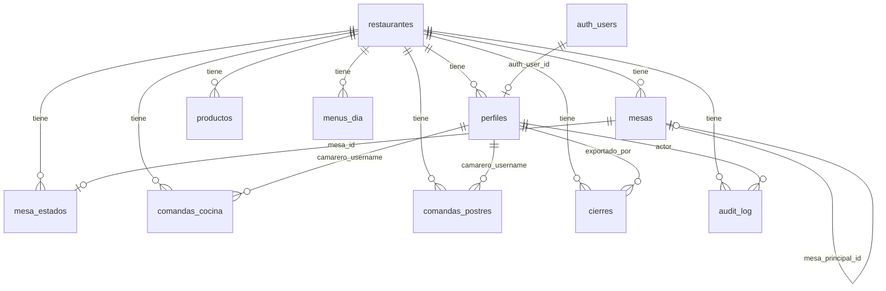

# Esquema Supabase — Comandero Taberneta

Referencia del diseño en `supabase/schema.sql`.
Alineado con tipos en `src/types/*`.

## Diagrama de relaciones

## Enums

| Enum Postgres | Valores | Equivalente TS |
|---------------|---------|----------------|
| `ct_rol` | ADMIN, CAMARERO | `Rol` |
| `ct_estado_mesa` | libre, ocupada, pendiente, servida, cobrando | `EstadoMesaOperativo` |
| `ct_estado_panel` | pendiente, en_preparacion, listo, servido | `EstadoPanel` |
| `ct_zona_mesa` | comedor, barra, fachada, terraza, rambla | `ZonaMesa` |
| `ct_seccion_catalogo` | entrantes, primeros, segundos, bebidas, postres, extras, salsas | `SeccionCatalogo` |
| `ct_tipo_servicio` | menu, carta, mixto | `TipoServicio` |

## Tablas

### `restaurantes`

Tenant raíz. Un registro inicial: La Taberneta.

| Columna | Tipo | Notas |
|---------|------|-------|
| id | UUID PK | También en `NEXT_PUBLIC_RESTAURANTE_ID` |
| nombre | text | Nombre comercial |
| slug | text UNIQUE | `la-taberneta` |
| activo | boolean | |
| created_at / updated_at / deleted_at | timestamptz | |

### `perfiles`

Extiende `auth.users` de Supabase Auth.

| Columna | Tipo | Notas |
|---------|------|-------|
| id | UUID PK | |
| auth_user_id | UUID UNIQUE FK → auth.users | Nullable hasta migración |
| restaurante_id | UUID FK | Multi-tenant |
| username | text | Login visible (`divarro`, `david`…) |
| nombre | text | Nombre en UI |
| rol | ct_rol | ADMIN / CAMARERO |
| camarero_id | text | ID lógico camarero (ej. `david`) |
| activo | boolean | |
| ultimo_acceso | timestamptz | |
| UNIQUE | (restaurante_id, username) | |

> Contraseñas **no** en esta tabla. Solo Supabase Auth en Fase 1.

### `mesas`

Configuración de mesas (equivalente `MesaConfig`).

| Columna | Tipo | Notas |
|---------|------|-------|
| id | UUID PK | Conserva IDs actuales al migrar |
| restaurante_id | UUID FK | |
| codigo | text | C1, R2B, TV… |
| nombre_visible | text | |
| zona | ct_zona_mesa | |
| activa | boolean | |
| orden | int | |
| permite_variante_b | boolean | Solo rambla |
| es_variante_b | boolean | |
| mesa_principal_id | UUID FK self | R2 → R2B |
| UNIQUE | (restaurante_id, codigo) | |

### `mesa_estados`

Estado operativo (equivalente `MesaEstadoPersistido`).

| Columna | Tipo | Notas |
|---------|------|-------|
| mesa_id | UUID PK FK | Una fila por mesa |
| restaurante_id | UUID FK | |
| estado | ct_estado_mesa | |
| manual | boolean | Override cobrando/liberar |
| actualizada_en | timestamptz | |

### `productos`

Carta / catálogo (equivalente `ProductoCatalogo`).

| Columna | Tipo | Notas |
|---------|------|-------|
| id | UUID PK | Conservar IDs para menú del día |
| restaurante_id | UUID FK | |
| nombre | text | |
| nombre_corto | text | |
| seccion | ct_seccion_catalogo | |
| tipo | text | carta / menu-dia / ambos |
| precio_carta | numeric | |
| precio_menu | numeric | |
| suplemento | numeric | |
| activo / agotado / favorito / recomendado | boolean | |
| orden | int | |
| descripcion_camarero | text | |
| ingredientes | jsonb | `string[]` |
| alergenos | jsonb | `AlergenoId[]` |
| notas_internas | text | |
| tiempo_preparacion | int | |

### `menus_dia`

Menú del día (equivalente `MenuDiaConfig`).

| Columna | Tipo | Notas |
|---------|------|-------|
| id | UUID PK | |
| restaurante_id | UUID FK | |
| fecha | date | YYYY-MM-DD |
| precio_menu | numeric | |
| primeros_ids | jsonb | UUID[] |
| segundos_ids | jsonb | UUID[] |
| postres_incluidos_ids | jsonb | UUID[] |
| suplemento_primeros / segundos | numeric | |
| observaciones | text | |
| activo | boolean | |
| UNIQUE | (restaurante_id, fecha) | |

### `comandas_cocina`

Ticket cocina/barra. Platos en **JSONB** (Fase 1).

| Columna | Tipo | Notas |
|---------|------|-------|
| id | UUID PK | Generado en cliente (offline futuro) |
| restaurante_id | UUID FK | |
| mesa_codigo | text | C1, R2B… (migración rápida) |
| mesa_id | UUID FK nullable | FK opcional a `mesas` |
| camarero_username | text | |
| camarero_nombre | text | Snapshot nombre |
| tipo_servicio | ct_tipo_servicio | |
| entrantes / primeros / segundos / bebidas | jsonb | `PlatoComanda[]` |
| extras | jsonb | `{ nombre, cantidad }[]` |
| observaciones | jsonb | `string[]` |
| estado_panel | ct_estado_panel | |
| enviada | boolean | |
| creada_en | timestamptz | |

### `comandas_postres`

Ticket postres separado.

| Columna | Tipo | Notas |
|---------|------|-------|
| id | UUID PK | |
| restaurante_id | UUID FK | |
| mesa_codigo | text | |
| mesa_id | UUID FK nullable | |
| camarero_username / nombre | text | |
| postres | jsonb | `PostreItem[]` |
| estado_x | text | sin_postre / pendiente / marcado |
| cl_h | boolean | |
| observaciones | jsonb | |
| estado_panel | ct_estado_panel | |
| enviada | boolean | |
| creada_en | timestamptz | |

### `cierres`

Snapshot de cierre de servicio (equivalente `ExportacionCierre`).

| Columna | Tipo | Notas |
|---------|------|-------|
| id | UUID PK | |
| restaurante_id | UUID FK | |
| fecha | date | Día de servicio |
| exportado_por_username | text | |
| exportado_por_nombre | text | |
| version | text | `1.0` |
| resumen | jsonb | Métricas `ResumenCierre` |
| snapshot | jsonb | Comandas + carta + menú + impresora |
| UNIQUE | (restaurante_id, fecha) | Un cierre por día |

### `audit_log`

Trazabilidad (Fase 4+).

| Columna | Tipo | Notas |
|---------|------|-------|
| id | UUID PK | |
| restaurante_id | UUID FK | |
| actor_username | text | |
| accion | text | crear_comanda, anular_linea… |
| entidad | text | comandas_cocina, productos… |
| entidad_id | UUID | |
| payload | jsonb | Detalle |
| created_at | timestamptz | |

## Row Level Security (RLS)

Funciones helper:

- `ct_current_restaurante_id()` — desde JWT claim o `perfiles`
- `ct_current_rol()` — ADMIN o CAMARERO
- `ct_is_admin()` — boolean

Políticas resumidas:

| Tabla | ADMIN | CAMARERO |
|-------|-------|----------|
| restaurantes | read own | read own |
| perfiles | CRUD own tenant | read own profile |
| mesas | CRUD | read activas |
| mesa_estados | CRUD | read + update estado |
| productos | CRUD | read activos |
| menus_dia | CRUD | read activos |
| comandas_cocina | CRUD | insert + read + update estado |
| comandas_postres | CRUD | insert + read + update estado |
| cierres | CRUD | — |
| audit_log | read | — |

## Índices principales

- `(restaurante_id)` en todas las tablas tenant
- `(restaurante_id, codigo)` en mesas
- `(restaurante_id, fecha)` en menus_dia, cierres
- `(restaurante_id, creada_en DESC)` en comandas
- `(restaurante_id, mesa_codigo)` en comandas
- GIN en JSONB de productos.ingredientes (búsqueda futura)

## Seed inicial

Incluido al final de `schema.sql`:

- Restaurante *La Taberneta de Ca la Ingrid*
- UUID fijo documentado para `NEXT_PUBLIC_RESTAURANTE_ID` en desarrollo

## Fuera del esquema (por diseño)

| Dato | Dónde queda |
|------|-------------|
| Borradores comanda/postres | localStorage (dispositivo) |
| Cola offline | IndexedDB (Fase 2) |
| Config impresora IP | localStorage + print-server (Fase 6) |
| Sesión activa | Supabase Auth JWT (Fase 1) |
